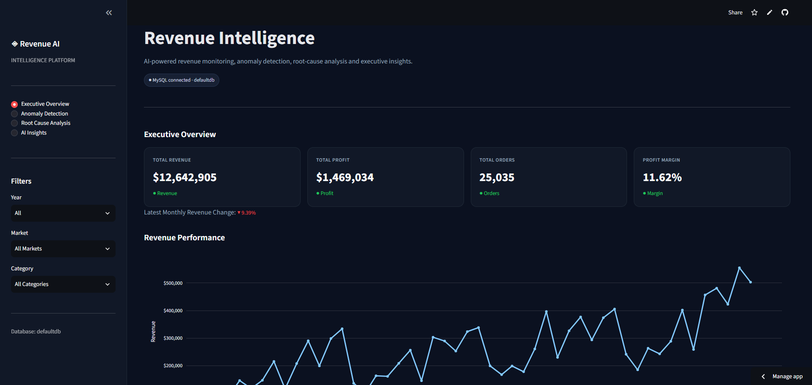
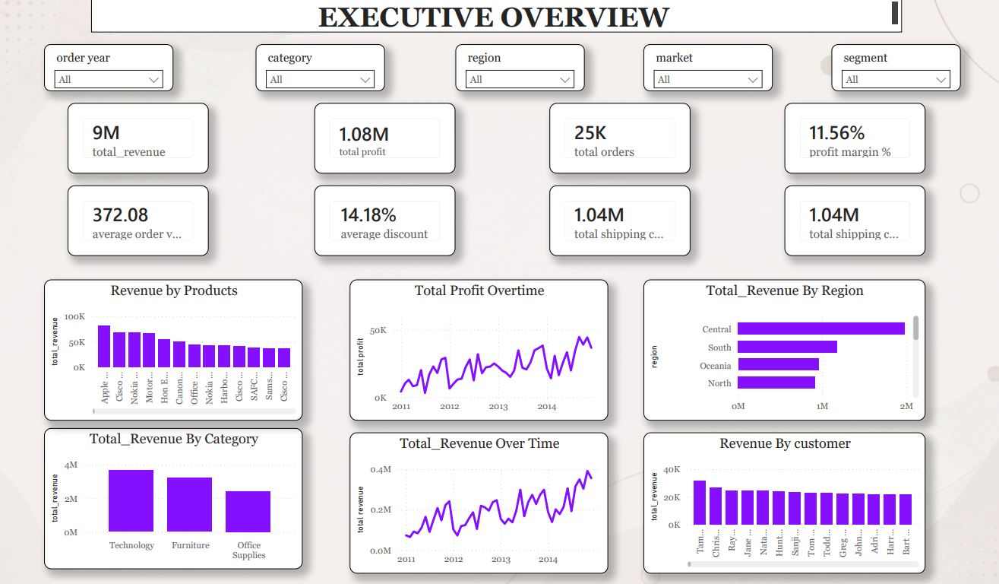
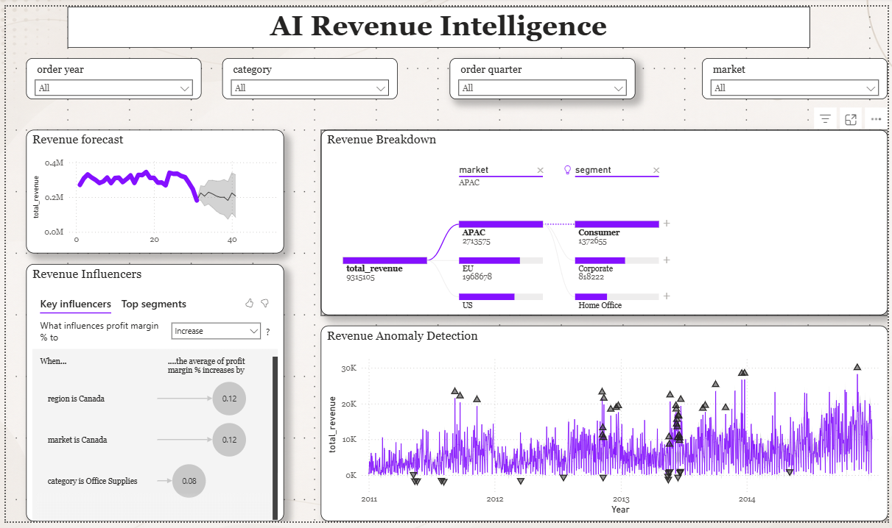
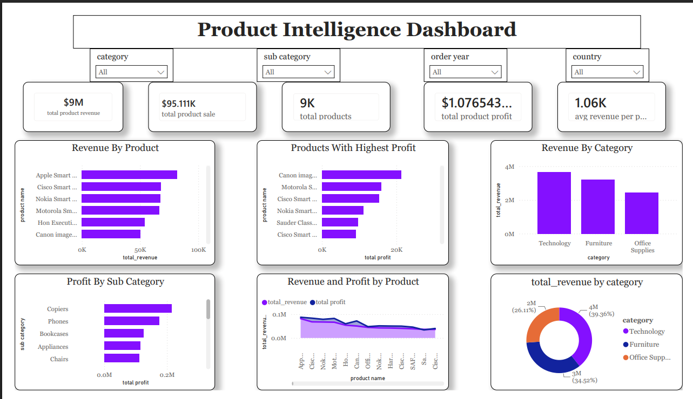

# 📊 AI Revenue Intelligence Agent

> ### 🚀 AI-Powered Revenue Monitoring, Business Intelligence & Forecasting Platform

An end-to-end **Revenue Intelligence Solution** built using **Python, SQL, MySQL, Excel, ETL, Power BI, Streamlit, and Google Gemini AI** to automate revenue monitoring, detect anomalies, perform root-cause analysis, forecast future sales, and generate AI-powered business insights.

<p align="left">

<a href="https://ai-revenue-intelligence-agent-6dfdedwheaxkadq2xpvvdj.streamlit.app/" target="_blank">

</a>

</p>

---

# 🛠️ Tech Stack

<p align="left">


</p>

---

# 📸 Project Preview

---

## 🤖 AI Revenue Intelligence Agent

### 🌐 Live Demo

### 🚀 https://ai-revenue-intelligence-agent-6dfdedwheaxkadq2xpvvdj.streamlit.app/



The **AI Revenue Intelligence Agent** is an interactive Streamlit application that combines business intelligence, machine learning, and generative AI into a single platform. It enables users to monitor revenue, analyze sales performance, forecast future trends, detect anomalies, and receive AI-generated business recommendations in real time.

### Key Highlights

- 📊 Interactive Revenue Dashboard
- 🤖 AI-Powered Business Insights
- 📈 Revenue Forecasting
- 🚨 Anomaly Detection
- 📦 Product Intelligence
- 💬 Natural Language Business Analysis
- ⚡ Fast & User-Friendly Interface

---

## 📈 Executive Dashboard



The Executive Dashboard provides a high-level overview of business performance through interactive KPIs and visualizations.

### Dashboard Features

- 💰 Total Revenue
- 📈 Total Profit
- 📦 Total Orders
- 🛒 Quantity Sold
- 📅 Monthly Revenue Trend
- 🌍 Revenue by Market
- 📂 Revenue by Category
- 👥 Top Customers
- 📊 Profit Analysis

### Executive Insights

- Monitor business performance at a glance.
- Identify revenue growth trends.
- Compare performance across different markets.
- Track category-wise contribution.
- Measure profitability.
- Support executive decision-making.

---

## 🤖 AI Revenue Analysis



The AI Revenue Analysis module leverages **Google Gemini AI** to transform raw business data into meaningful natural-language insights and recommendations.

### AI Features

- Revenue Summary
- Sales Trend Analysis
- Root Cause Analysis
- Growth Opportunity Detection
- Business Recommendations
- Executive Summary Generation

### Sample AI Insights

- Revenue increased significantly during the latest quarter.
- Technology products contribute the highest overall revenue.
- Western region consistently outperforms other markets.
- Furniture category requires margin optimization.
- Office Supplies maintain stable sales growth.

---

## 📦 Product Intelligence Dashboard



The Product Intelligence Dashboard provides detailed analysis of product performance, profitability, and category trends.

### Dashboard Features

- Product Revenue
- Product Profit
- Product Quantity Sold
- Top Performing Products
- Lowest Performing Products
- Category Revenue Analysis
- Product Profitability
- Product Trend Analysis

### Business Insights

- Discover best-selling products.
- Identify underperforming products.
- Compare category profitability.
- Optimize inventory planning.
- Improve pricing strategy.
- Increase overall product profitability.

---

# 🚀 Project Overview

The **AI Revenue Intelligence Agent** transforms raw transactional sales data into actionable business intelligence.

The platform combines:

- 📊 Power BI Dashboards
- 🤖 Google Gemini AI
- 📈 Machine Learning Forecasting
- 🗄 SQL & MySQL Database
- 📑 Excel Data Processing
- 🔄 ETL Pipeline
- 🌐 Streamlit Web Application

The goal is to automate revenue analysis and enable business leaders to make faster, data-driven decisions.

---

# ✨ Key Features

## 📊 Business Intelligence

- Executive Dashboard
- Product Intelligence Dashboard
- Revenue Trends
- Customer Insights
- Market Performance
- Category Analysis

---

## 🤖 Artificial Intelligence

- AI Revenue Summary
- AI Business Recommendations
- Root Cause Analysis
- Trend Explanation
- Executive Insights
- Growth Opportunity Detection

---

## 📈 Machine Learning

- Revenue Forecasting
- Sales Prediction
- Trend Analysis
- Business Pattern Recognition

---

## 🚨 Anomaly Detection

The system automatically detects:

- Revenue Drops
- Revenue Spikes
- Seasonal Changes
- Product Sales Anomalies
- Regional Performance Changes

Benefits include:

- Early risk detection
- Faster business monitoring
- Reduced revenue loss
- Improved operational planning

---

# 📊 Dashboard Modules

## 📈 Executive Dashboard

✔ Revenue KPIs

✔ Profit KPIs

✔ Monthly Revenue Trends

✔ Customer Analysis

✔ Market Analysis

✔ Category Performance

---

## 📦 Product Intelligence Dashboard

✔ Product Revenue

✔ Product Profit

✔ Quantity Sold

✔ Product Ranking

✔ Category Comparison

✔ Profitability Analysis

---

## 🤖 AI Revenue Intelligence

✔ AI Revenue Summary

✔ Business Recommendations

✔ Root Cause Analysis

✔ Executive Insights

✔ Trend Analysis

✔ Growth Opportunities

---

# 💼 Business Value

This solution enables organizations to:

- Improve revenue visibility.
- Automate business reporting.
- Detect sales anomalies.
- Forecast future revenue.
- Optimize product performance.
- Support executive decision-making.
- Reduce manual reporting effort.
- Increase operational efficiency.

---

# 📈 Machine Learning Features

- Revenue Forecasting
- Sales Prediction
- Trend Analysis
- Time Series Forecasting
- Business Pattern Recognition
- Revenue Growth Estimation

---

# 📂 Project Structure

```text
AI-Revenue-Intelligence-Agent
│
├── app.py
├── data/
├── notebooks/
├── powerbi/
├── screenshots/
│   ├── ai-home.png
│   ├── executive-dashboard.png
│   ├── ai-analysis.png
│   └── product-intelligence.png
├── requirements.txt
└── README.md
```

---

# ⚙️ Installation

## Clone Repository

```bash
git clone https://github.com/divyansh678/Ai-revenue-intelligence-agent.git
```

## Move into Project Folder

```bash
cd Ai-revenue-intelligence-agent
```

## Install Required Packages

```bash
pip install -r requirements.txt
```

## Run the Streamlit Application

```bash
streamlit run app.py
```

---

# 🎯 Future Enhancements

- 🌐 Live Database Integration
- 📧 Automated Email Alerts
- 🤖 AI Chat Assistant
- 📱 Mobile Responsive Dashboard
- 📦 Inventory Intelligence
- 👥 Customer Intelligence Dashboard
- ☁ Cloud Deployment
- 📈 Advanced Predictive Analytics
- 🔔 Real-Time Revenue Monitoring

---

# 👨‍💻 Author

## **Divyansh Singh**

**Aspiring Data Analyst | AI & Machine Learning Enthusiast**

### 🔗 GitHub

https://github.com/divyansh678

### 🌐 Live Demo

https://ai-revenue-intelligence-agent-6dfdedwheaxkadq2xpvvdj.streamlit.app/

### 💼 LinkedIn

Add your LinkedIn Profile Here

### 📧 Email

Add your Email Here

---

# ⭐ Support

If you found this project useful, please consider giving it a **⭐ Star** on GitHub.

Your support motivates me to build more AI, Machine Learning, and Data Analytics projects.
